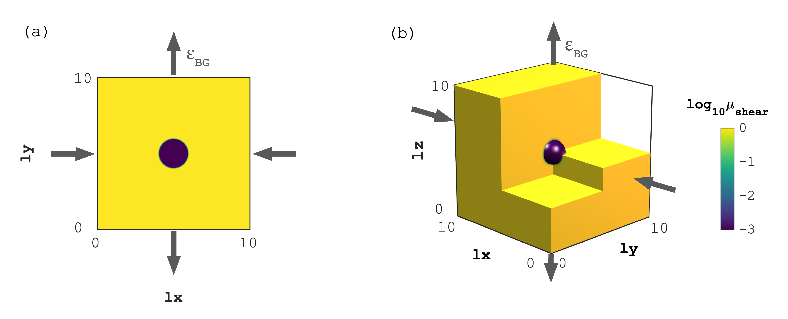
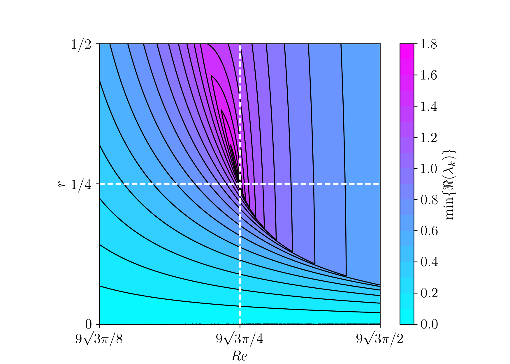

# PseudoTransientStokes.jl

[](https://github.com/PTsolvers/PseudoTransientStokes.jl/actions/workflows/CI.yml?query=branch%3Amain)
[](https://zenodo.org/badge/latestdoi/344470133)

Parallel (multi-) XPU iterative 2D and 3D incompressible Stokes flow solvers with viscous and Maxwell visco-elastic shear rheology. This software is part of the [**PTsolvers project**](https://ptsolvers.github.io/).

The aim of this project is to provide iterative solvers **assessing the scalability, performance, and robustness of the accelerated pseudo-transient method** with application to Stokes flow and mechancial processes. The solution strategy characterises as semi-iterative, implementing the second-order convergence acceleration as introduced by, e.g., [Frankel (1950)](https://doi.org/10.2307/2002770).

This repository, together with [**PseudoTransientDiffusion.jl**](https://github.com/PTsolvers/PseudoTransientDiffusion.jl/), relates to the original research article draft submitted to the _**Geoscientific Model Development**_ journal:
```tex
@Article{gmd-15-5757-2022,
    AUTHOR = {R\"ass, L. and Utkin, I. and Duretz, T. and Omlin, S. and Podladchikov, Y. Y.},
    TITLE = {Assessing the robustness and scalability of the accelerated pseudo-transient method},
    JOURNAL = {Geoscientific Model Development},
    VOLUME = {15},
    YEAR = {2022},
    NUMBER = {14},
    PAGES = {5757--5786},
    URL = {https://gmd.copernicus.org/articles/15/5757/2022/},
    DOI = {10.5194/gmd-15-5757-2022}
}
```

## Content
* [Stokes flow](#stokes-flow)
* [Scripts](#scripts)
* [Optimal iteration parameters](#optimal-iteration-parameters)
* [Additional infos](#additional-infos)
* [Questions, comments and discussions](#questions-comments-and-discussions)

## Stokes flow
In this study we resolve viscous and visco-elastic Stokes flow in 2D and 3D, using the following equation:
```julia
0 =  ∇ ⋅ v
0 = (∇ ⋅ μ∇v) - ∇p + f
```
where `v` is the velocity, `µ` the viscosity, `p` the pressure and `f` the external forces.

We use the following initial condition in 2D and 3D, respectively:
 


## Scripts
The [**scripts**](/scripts) folder contains the various Julia routines to solve the Stokes flow in 2D (`Stokes2D_*.jl`) and 3D (`Stokes3D_*.jl`). The 3D scripts are grouped in a separate [stokes_3D](/scripts/stokes_3D) including shell scripts to automatise multi-XPU execution. All Julia routines depend on:
- [ParallelStencil.jl](https://github.com/omlins/ParallelStencil.jl) to allow for backend-agnostic parallelisation on multi-threaded CPUs and Nvidia GPUs (AMD support being _wip_)
- [Plots.jl](https://github.com/JuliaPlots) for basic visualisation
- [MAT.jl](https://github.com/JuliaIO/MAT.jl) for file I/O (disk save for publication-ready figures post-processing using Matlab [visualisation scripts](/visu))

All 3D routines, with exception of one, rely additionally on:
- [ImplicitGlobalGrid.jl](https://github.com/eth-cscs/ImplicitGlobalGrid.jl) to implement global grid domain decomposition, relying on 
- [MPI.jl](https://github.com/JuliaParallel/MPI.jl) as communication library for distributed memory, point-to-point communication.

### Running the scripts
To get started, clone or download this repository, launch Julia in project mode `julia --project` and `instantiate` or `resolve` the dependencies from within the REPL in package mode `julia> ]`.

The 2D scripts can be launched either from with the REPL:
```julia-repl
julia> include("Stokes2D_<script_name>.jl")
```
or executed from the shell as:
```shell
julia --project --check-bounds=no -O3 Stokes2D_<script_name>.jl
```
Note that for optimal performance, scripts should be launched from the shell making sure bound-checking to be deactivated.

The 3D scripts can be launched in distributed configuration using, e.g., MPI. This requires either to use the Julia MPI launcher `mpiexecjl` or to rely on system provided MPI ([more here](https://juliaparallel.github.io/MPI.jl/latest/configuration/)).

_:bulb: **Note:** refer to the documentation of your supercomputing centre for instructions to run Julia at scale. Instructions for running on the Piz Daint GPU supercomputer at the [Swiss National Supercomputing Centre](https://www.cscs.ch/computers/piz-daint/) can be found [here](https://user.cscs.ch/tools/interactive/julia/)._

All scripts parse environment variables defining important simulation parameters, defaulting to heuristics, namely
```julia
USE_RETURN=false, USE_GPU=false, DO_VIZ=true, DO_SAVE=false, DO_SAVE_VIZ=false
```
and
```julia
NX, NY, NZ
```
defaulting to `255` in 2D and `63` in 3D. Running, e.g., a script from the shell using the GPU backend can be achieved as following:
```shell
USE_GPU=true julia --project --check-bounds=no -O3 Stokes2D_<script_name>.jl
```

## Optimal iteration parameters
The folder [**dispersion_analysis**](/dispersion_analysis) contains the analytical derivations for the values of iteration parameters. We provide these derivations for 1D viscous Stokes problem. Only the case of `μ=const` is considered.

The main output of the script is the theoretically predicted value for the non-dimensional parameters `Re` and `r`, which are used in the solvers. The figure showing the dependency of the residual decay rate on `Re` and `r` is also displayed:



For users' convenience, we provide two versions of each script, one version written in Matlab and the other in Python.

To launch the Matlab version, the working installation of Matlab and [Matlab Symbolic Math Toolbox](https://www.mathworks.com/products/symbolic.html) is required.

The second version is implemented using the open-source computer algebra library [SymPy](https://www.sympy.org/) as a [Jupyter](https://jupyter.org/)/[IPython](https://ipython.org/) notebook. The Jupyter notebooks can be viewed directly on GitHub ([example](https://github.com/PTsolvers/PseudoTransientStokes.jl/blob/main/dispersion_analysis/dispersion_analysis_stokes1D.ipynb)). However, in order to view the notebook on a local computer or to make changes to the scripts, the recent Python installation is required. Also, several Python packages need to be installed: SymPy, NumPy, Jupyter, and Matplotlib. The easiest way to install these packages along with their dependencies is to use the [Anaconda](https://www.anaconda.com/products/individual) platform.

After installing `Anaconda`, open the terminal, `cd` into the `dispersion_analysis` folder and create a new `conda` environment with the following command:
```
> conda create -n ptsolvers sympy numpy jupyter matplotlib
```
This command will install the required packages. After the installation completes, activate the environment:
```
> conda activate ptsolvers
```
The final step is to launch the Jupyter server:
```
> jupyter notebook
```
This command starts a server and opens the browser window with file manager.

## Additional infos
The repository implements a reference tests suite, using [ReferenceTests.jl](https://github.com/JuliaTesting/ReferenceTests.jl), to verify the correctness of the outputed results with respect to a reference solution.

## Questions, comments and discussions
To discuss technical issues, please post on Julia Discourse in the [Julia at Scale topic](https://discourse.julialang.org/c/domain/parallel/) or in the `#gpu` or `#distributed` channels on the [Julia Slack](https://julialang.slack.com/) (to join, visit https://julialang.org/slack/).
To discuss numerical/domain-science issues, please post on Julia Discourse in the [Numerics topic](https://discourse.julialang.org/c/domain/numerics/) or the [Modelling & Simulations topic](https://discourse.julialang.org/c/domain/models) or whichever other topic fits best your issue.
